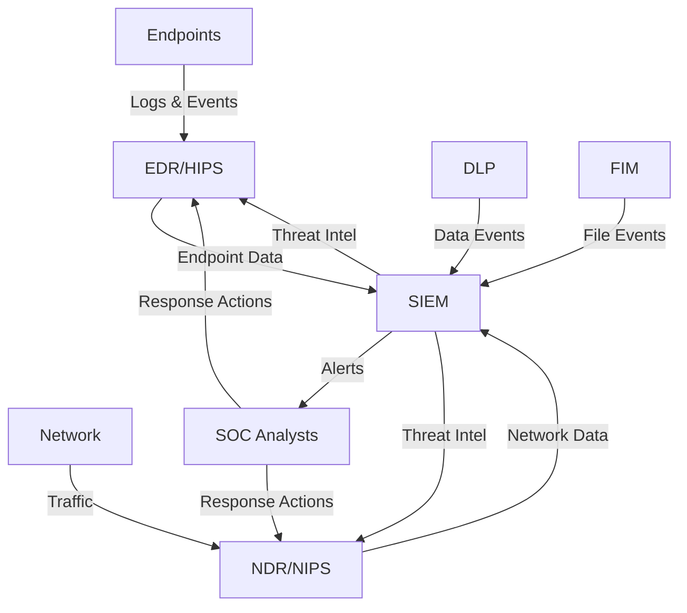

# Security Operations Center (SOC) Architecture

This document outlines the architecture and integration points of the Security Operations Center, which combines multiple security components into a cohesive system.

## Core Components

### 1. Security Information and Event Management (SIEM)
- **Purpose**: Centralized logging, correlation, and alerting
- **Key Features**:
  - Log collection and normalization
  - Real-time event correlation
  - User and Entity Behavior Analytics (UEBA)
  - Compliance reporting
  - Incident response workflow
- **Integration Points**:
  - Receives logs from all other components
  - Provides alerts to SOC analysts
  - Feeds threat intelligence to other components

### 2. Endpoint Detection and Response (EDR)
- **Purpose**: Endpoint protection and forensics
- **Key Features**:
  - Process monitoring and analysis
  - Behavioral detection of malicious activities
  - Endpoint forensics and investigation
  - Threat hunting capabilities
- **Integration Points**:
  - Sends endpoint telemetry to SIEM
  - Receives IOCs and detection rules
  - Provides isolation and remediation capabilities

### 3. Network Detection and Response (NDR)
- **Purpose**: Network traffic analysis and threat detection
- **Key Features**:
  - Deep packet inspection
  - Anomaly detection
  - Encrypted traffic analysis
  - Network flow analysis
- **Integration Points**:
  - Feeds network events to SIEM
  - Receives threat intelligence updates
  - Works with NIPS for blocking malicious traffic

### 4. Data Loss Prevention (DLP)
- **Purpose**: Protect sensitive data
- **Key Features**:
  - Content inspection
  - Policy enforcement
  - User activity monitoring
  - Data classification
- **Integration Points**:
  - Integrates with SIEM for alerting
  - Works with NDR to monitor data in transit
  - Enforces policies on endpoints via EDR

### 5. File Integrity Monitoring (FIM)
- **Purpose**: Monitor critical system files
- **Key Features**:
  - Real-time file monitoring
  - Change detection
  - Checksum verification
  - Compliance reporting
- **Integration Points**:
  - Sends alerts to SIEM
  - Works with EDR for endpoint file monitoring
  - Supports compliance reporting in SIEM

### 6. Host-based Intrusion Prevention System (HIPS)
- **Purpose**: Protect individual hosts
- **Key Features**:
  - Application whitelisting
  - System call monitoring
  - Exploit mitigation
  - Memory protection
- **Integration Points**:
  - Integrates with EDR for endpoint protection
  - Sends alerts to SIEM
  - Receives threat intelligence updates

### 7. Network Intrusion Prevention System (NIPS)
- **Purpose**: Network traffic filtering
- **Key Features**:
  - Signature-based detection
  - Protocol analysis
  - Automated blocking
  - Traffic normalization
- **Integration Points**:
  - Receives threat feeds from SIEM
  - Works with NDR for detection
  - Enforces network security policies

## Data Flow

## Integration Patterns

### 1. Threat Intelligence Sharing
- SIEM acts as the central hub for threat intelligence
- IOCs and detection rules are distributed to all components
- Automated response actions can be coordinated across components

### 2. Unified Alerting
- All security events are normalized and correlated in SIEM
- Alerts are prioritized based on risk scoring
- Automated response actions can be triggered based on alert severity

### 3. Cross-Component Correlation
- Network events from NDR/NIPS are correlated with endpoint events from EDR
- File integrity alerts are cross-referenced with process execution events
- User activities are analyzed across all components for UEBA

## Implementation Guidelines

1. **Deployment Strategy**:
   - Start with SIEM as the central component
   - Add EDR for endpoint visibility
   - Implement NDR/NIPS for network monitoring
   - Layer on DLP and FIM based on compliance requirements

2. **Data Retention**:
   - Store high-fidelity logs for 90+ days
   - Keep aggregated data for 1+ years
   - Implement data archiving for compliance

3. **Response Playbooks**:
   - Define standard operating procedures for common threats
   - Automate response actions where possible
   - Document escalation paths for security incidents

4. **Performance Considerations**:
   - Distribute processing load across components
   - Implement rate limiting and sampling where appropriate
   - Monitor system performance and scale as needed

## Future Enhancements

1. **SOAR Integration**:
   - Automate response workflows
   - Integrate with ticketing systems
   - Implement case management

2. **Threat Hunting**:
   - Proactive threat detection
   - Hypothesis-driven investigations
   - Custom detection rules

3. **Cloud Integration**:
   - Extend to cloud workloads
   - Monitor cloud-native services
   - Implement cloud security posture management
